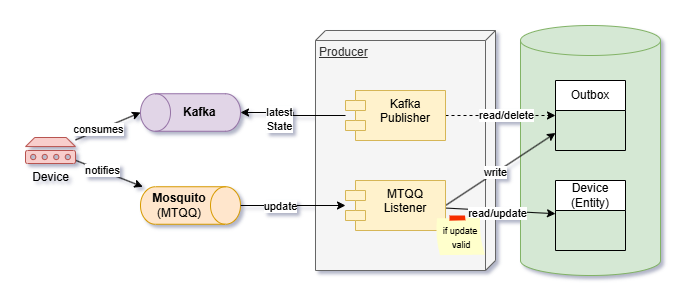

# Producer

A Spring Boot service that receives **device updates** (e.g. temperature, status) over **MQTT**, validates **device state transitions**, persists devices in a database, and publishes the current **device-state snapshot** to **Kafka** via an outbox. It also exposes mock and outbox APIs for testing.

This application is a fictitious IoT-style producer used as a canonical dataset for a Fullstack Developer role. The scope is limited to a single domain—room temperature–measuring devices—and to the **latest state only**: no historical data is stored. Each device is identified by `deviceId` and carries `name`, `status`, and a reported temperature; an incoming message either creates a new device or updates an existing one based on `deviceId`. A simple device state machine enforces allowed status transitions (e.g. PENDING→ACTIVE, ACTIVE→INACTIVE) to illustrate business-rule validation without over-engineering.

**MQTT** was chosen for receiving updates because it fits the IoT context: lightweight, high throughput, and well-suited to many devices sending frequent updates. Since only the most recent state per device matters, occasional message loss is acceptable. **Kafka** is used to expose that state to other domains: it provides durability, fault tolerance, and scalability so consumers can reliably read the latest producer state. A **mock REST API** (see the `mock_testing` package) is provided for manual testing of the flow (simulate MQTT input and Kafka consumption) and is not intended for production use.

## Architecture



## What it does

- **MQTT** – Subscribes to a topic and consumes device update messages.
- **Validation** – New devices must have status `PENDING`; existing devices follow allowed status transitions (e.g. PENDING→ACTIVE, ACTIVE→INACTIVE).
- **Persistence** – Stores devices in an H2 (in-memory) database.
- **Outbox + Kafka** – Writes a full device snapshot to an outbox and publishes it to a Kafka topic so other services can consume device state.

## Run instructions

**Recommended: Docker Compose** (starts MQTT, Kafka, and the app in one go)

From the project root:

```bash
docker compose up -d
```

- App: **http://localhost:8080** (login: `admin` / `admin`)
- **Swagger UI:** http://localhost:8080/swagger-ui.html
- Rebuild and start: `docker compose up -d --build`
- Stop: `docker compose down`

---

**Optional: run locally** (Java 21, Maven wrapper)

```bash
./mvnw spring-boot:run
```

On Windows: `mvnw.cmd spring-boot:run`. The app runs on port 8080; **Swagger UI:** http://localhost:8080/swagger-ui.html. For MQTT and Kafka you need brokers running (e.g. start only infra with `docker compose up -d mosquitto kafka` and point the app at `localhost:1883` / `localhost:9094`).
